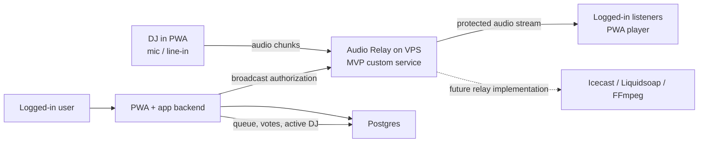

# PWA Live Audio Design

## Goal

Build a PWA for a single shared live music channel. At any moment one DJ broadcasts from a browser using a microphone or line-in input, and all logged-in listeners hear that same signal. Login is required for listening, voting, viewing the queue, and DJ actions. Registration is protected by a small pre-registration gate that requires a special access password.

## MVP Scope

- One global antenna.
- One active DJ at a time.
- Registration requires a shared special access password before the account creation form is available.
- Login required for listening, voting, queue visibility, and DJ actions.
- Users can self-enable a DJ profile without admin approval.
- DJs can still listen like regular users.
- DJs join a queue to take over the antenna.
- Voting to change DJ is available only when at least one DJ is waiting in the queue.
- DJ changes by vote require 60% of currently present logged-in listeners to vote for the change.
- No play-time limit when the queue is empty.
- Stable radio-style latency is acceptable, roughly 10-30 seconds.
- DJ broadcasting happens from the browser PWA, not from OBS, Butt, Mixxx, or another external encoder.
- Initial scale target is up to 50 simultaneous listeners.
- No chat, likes, comments, set history, or recording in MVP.

## Recommended Architecture

Use a hybrid architecture:

- PWA and application backend run on a managed web platform.
- Postgres stores users, DJ profiles, queue state, sessions, votes, and presence.
- The application backend validates the registration access password before allowing new account creation.
- A separate audio relay runs on a VPS.
- The browser DJ client sends audio chunks to the relay over a controlled connection.
- Logged-in listeners play a single protected stream endpoint exposed by the relay.
- The application backend authorizes which DJ is allowed to send audio.

The MVP relay can be a custom Node service. Its interface should be isolated behind an `AudioRelay` contract so the implementation can later move to an Icecast, Liquidsoap, or FFmpeg-based pipeline without rewriting application-level features.

## User Roles

### Logged-In Listener

- Can open the player.
- Can play and pause the current stream.
- Can see current DJ metadata and listener count.
- Can see the full DJ queue.
- Can vote to change DJ when the queue is not empty.
- Can create or activate a DJ profile.

### New User

- Must pass a registration access gate before creating an account.
- Enters a shared special password on a small pre-registration screen.
- Can continue to the normal registration form only after the gate succeeds.
- Cannot listen, vote, or view the queue until registered and logged in.

### DJ

- Is a logged-in user with an active DJ profile.
- Can still listen normally.
- Can join the DJ queue.
- Can broadcast only when they are the active DJ.
- Can voluntarily hand over the antenna.

## Screens

### Registration Gate

Shows:

- Special access password input.
- Continue control.
- Generic error state when the password is invalid.

Does not show:

- Account registration fields before the gate succeeds.
- Whether a specific email or account already exists.

### Logged-In Player

Shows:

- Current DJ display name.
- DJ city.
- DJ description or short bio.
- Live status.
- Play and pause controls.
- Listener count.

### Logged-In Listener View

Shows:

- Player.
- Full DJ queue.
- Voting control when a DJ is live and the queue is not empty.
- Vote progress toward the 60% threshold.

### User Profile

Shows:

- User account details.
- Action to create or activate a DJ profile.

### DJ Profile

Fields:

- Display name.
- City.
- Soundsystem.
- Description.
- Active/inactive DJ status.

### DJ Panel

Shows:

- Audio input selector.
- Always-visible input level meter.
- Connection and stream status.
- Queue position.
- `Join queue` control.
- `Start broadcast` control when this DJ has the antenna.
- `Hand over antenna` control while broadcasting.

## Antenna Rules

- If no DJ is live, the antenna is idle.
- If a DJ is live and the queue is empty, there is no time limit.
- DJs can join the queue when another DJ is live or when the antenna is idle.
- Voting appears only when the queue has at least one waiting DJ.
- A logged-in user can vote once per active broadcast session.
- A DJ change by vote happens when 60% of currently present logged-in listeners vote for change.
- After a successful vote, the first DJ in the queue becomes eligible to start broadcasting.
- The previous active DJ should get a short cooldown before rejoining, initially 10 minutes, to avoid immediate cycling.

## Presence And Vote Counting

Only logged-in listeners can listen and only logged-in listeners count toward the 60% threshold.

A logged-in listener is considered present when the app has sent a heartbeat recently, for example within the last 30 seconds. Presence should expire automatically when heartbeats stop.

The denominator for vote threshold is the number of currently present logged-in listeners. The numerator is the number of those listeners who voted to change the active DJ during the current broadcast session.

## Data Model

### users

- ID.
- Auth provider identity.
- Display name.
- Registration gate passed timestamp if useful for audit/debugging.
- Optional avatar.
- Created and updated timestamps.

### dj_profiles

- ID.
- User ID.
- Display name.
- City.
- Soundsystem.
- Description.
- Active status.
- Created and updated timestamps.

### broadcast_sessions

- ID.
- DJ profile ID.
- Status: `pending`, `live`, `ended`, `interrupted`.
- Started at.
- Ended at.
- End reason.

### dj_queue

- ID.
- DJ profile ID.
- Position or queued timestamp.
- Status: `waiting`, `active`, `skipped`, `completed`, `cooldown`.

### listener_presence

- User ID.
- Last heartbeat timestamp.
- Current page or listening state if useful.

### change_votes

- ID.
- Broadcast session ID.
- User ID.
- Created timestamp.

### stream_state

- Singleton or latest state record.
- State: `idle`, `waiting_for_dj`, `live`, `handover`, `relay_unavailable`.
- Active broadcast session ID.
- Active DJ profile ID.

## Audio Flow

1. DJ opens the PWA and selects an audio input device.
2. The DJ panel displays the input level meter continuously.
3. When the DJ has the antenna, they can start broadcasting.
4. The browser captures audio and sends chunks to the audio relay.
5. The audio relay validates that the sender is the authorized active DJ.
6. The relay exposes one protected stream endpoint for authenticated listeners.
7. Listener clients play the protected endpoint with radio-style buffering.

## Error Handling

- If the registration access password is wrong, the app shows a generic invalid access message.
- Registration gate attempts should be rate-limited to reduce brute-force guessing.
- If a non-active DJ tries to stream, the relay rejects the connection.
- If the active DJ disconnects, the system allows a short grace period, initially 15 seconds.
- If the stream does not return during the grace period, the system moves to the next queued DJ.
- If the queue is empty after a disconnect, the antenna returns to idle.
- If the relay is unavailable, the PWA shows that the stream is temporarily unavailable while the application backend preserves queue and session state.
- If presence heartbeats stop, logged-in listeners stop counting toward the vote threshold.

## Testing Strategy

- Unit-test queue transitions and vote threshold logic.
- Unit-test presence expiry and vote eligibility.
- Integration-test backend authorization for active DJ streaming.
- Integration-test relay rejection for unauthorized broadcasters.
- Browser-test the main listener flow: log in, open player, play stream, handle unavailable state.
- Browser-test the DJ flow: select input, see level meter, join queue, start broadcast when active, hand over.

## Implementation Notes

- Keep audio relay concerns separate from application state.
- Define an `AudioRelay` interface early, even if the first implementation is simple.
- Avoid building admin tools in MVP.
- Make vote threshold and cooldown configurable.
- Treat browser audio compatibility as a risk area and test Chrome, Edge, and mobile browsers early.
